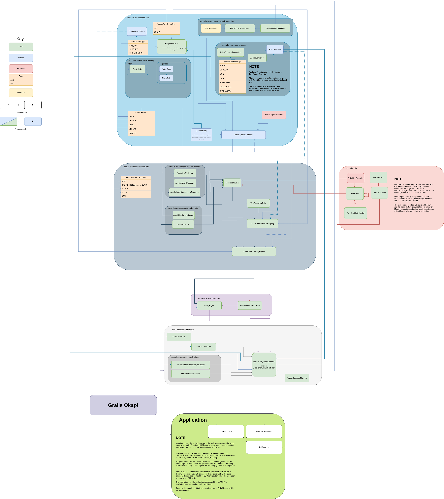

Access control (RBAC) and inner-tenant separation
=================================================

# Introduction

Access control is an important aspect of an application,
allowing shared data to be accessed by different parties depending on some level of access granted them on the
system. In particular in FOLIO, the data is separated across tenant lines with a separate schema for each tenant in
the database. This is a particular issue in the likes of mod-agreements, where there is an additional set of data
(the local KB) which is then needed to be ingested for each and every tenant.

# Planning and strategy

## Original plan

Originally, the access control model planned for these KInt modules was to use a "grant" based system for true ABAC
(attribute based access control) and RBAC (role based access control). This would have been a departure from the
existing model present in FOLIO "Acquisition units" but would have provided a significantly more robust access
control system. However the complexity of this system, coupled with the desire for whatever model was chosen to ALSO
be compatible with these Acquisition units, led to that work being postponed. It is still desirable at some point in
the future, but for now the implementation will focus on acquisition units.

## Final strategy

The final strategy was to create an external java library which would handle the bulk of operations around access
control. It would need to be framework agnostic, so that it could be lifted in the future if/when the grails modules
are rewritten in Micronaut, and to make as few assumptions about the calling code as possible. This design ethos led
to the development of the current AccessControl package in mod-agreements, which will be lifted out as an external
library when the first implementation in another module is required.

# Acquisition units

Acquisition units represent a model chosen by the acquisition team to perform this kind of access control in FOLIO.
They have since been adopted into other modules such as finance, as well as others.

## Implementation

The implementations of this in the various modules seems to be written directly into each module's codebase, and
does not allow for extensions to some other form of RBAC in future, so using the code that already existed is not
an option for us. In addition the ownership of a resource by acquisition units is determined by a field on the
resource itself. This is not a model we are willing to replicate directly, especially with potential future work to
allow other forms of RBAC.

## Behaviour

Acquisition units are set up in FOLIO > Settings > Acquisition units
These are named, and can have FOLIO users assigned to them. They allow for 4 basic protections:

- `protectRead`
- `protectUpdate`
- `protectCreate`
- `protectDelete`

Each of these can be "restricted" or "not restricted" for any given acquisition unit.
The behaviour of these is not necessarily immediately intuitive from the names.

`protectRead`, `protectUpdate` and `protectDelete` protection work largely as
expected, any resource "owned" by an acquisition unit with `protectRead` restriction, say, will only show up in
searches for users of that acquisition unit and direct API calls for that resource will be restricted likewise.

`protectCreate` however does _not_ restrict the creation of new resources. Since the acquisition units live on
resources themselves, what this _actually_ protects is the ability to assign said unit to a given resource.
Slightly confusingly this restriction applies both to assigning a unit to a new resource (on create) but _also_ to
assigning a unit on an existing resource (on edit). This means that a user who is not assigned to any of the
`protectCreate` restricted units will still be able to create a new resource (FOLIO permissions permitting), but
will not be able to assign any acquisition units to it (simplified slightly--see below)

The simplification above comes from the fact that a unit can be valid for a resource _without_ a certain protection
present, and also the behaviour when two or more units are present for a single resource.

If resource A is owned by unit 1, and unit 1 has:

- `protectRead` ⬜
- `protectUpdate`✅
- `protectCreate`✅
- `protectDelete`✅

Then read is treated as not restricted for that resource at all, but updates and deletes _will_ be restricted, and
only users on that unit will be allowed to assign the unit to resources.

If unit 2 was then added to the resource, and restricted as follows:

- `protectRead` ✅
- `protectUpdate`✅
- `protectCreate`⬜
- `protectDelete`✅

Then the behaviour becomes a little more confusing. Read is now UNRESTRICTED by unit 1 and RESTRICTED by unit 2.
The default behaviour in FOLIO is to use the least restrictive policy, so applying an "unrestricted" policy for READ
will in fact grant access to the resource for all users.

Update is RESTRICTED for unit 1 _and_ for unit 2. The chosen behaviour here for FOLIO is permissive, so if the user
is a member of unit 1 _or_ unit 2 then write access will be granted, similarly for delete.

Create is RESTRICTED for unit 1 and UNRESTRICTED for unit 2. This manifests as _any_ user (who has write access to
the resource) being able to assign unit 2 to the resource, but only members of unit 1 being able to do the same for
that unit. Unit 2 is set up in such a way that a user could "soft lock" themselves out of a resource they created if
they're not a member of unit 2.

# AccessControl design

The design of the access control work is encapsulated by the following diagram (Click to enlarge)
[  ](access-control-diagram.png "Access Control
model")

## Overview

The basic approach is as follows. Each module will be responsible for several "PolicyControlled" resources. These
resources will not need to change, no addition of "access control" fields etc etc. If a resource is API accessible
and owned by some other PolicyControlled resource then the access policies on the _owner_ will determine access to
the resource. This will all be managed via an @PolicyControlled tag on the resource.

A separate table for AccessPolicyEntities will act as a join between policies from an external system (external to
the module, such as Acquisition units, or even external to FOLIO, such as KI Grants potentially in future. In
theory nothing prevents an internal access system but that has not been planned for.)

When a resource is accessed through some sort of framework (Grails, micronaut, etc), an intepretation layer will
provide the API calls, either intercepting normal CRUD operations or providing helper API calls such as `canRead` etc.

This framework layer will call down to a pure java library PolicyEngine, which will parse which types of access control
are to be performed (ACQ_UNIT vs KI_GRANT etc) and delegate specific logic to several pure java plugins to perform the
business logic, before combining the results and returning them to the framework layer.

## Structure

The structure of this work as delivered is as follows:

- Core (com.k-int.accesscontrol.core)
- Main (com.k-int.accesscontrol.main)
- Acquisition unit plugin (com.k-int.accesscontrol.acqunits)
- Grails framework layer (com.k-int.accesscontrol.grails)
- Module layer (setup of the PolicyControlled resources)

As per the overview, we have the "main" java library, which is interracted with by the "framework layer" which in
turn can be imported into each implementing module.

The "main" library delegates the acquisition unit logic to a "plugin" library, and all 3 of those are shaped by
interfaces and classes available from the "core" library.

As can be seen from the diagram, this leads to a fairly natural separation of concerns at each layer.

- The final module should _only_ need to import the framework
  layer itself
    - The one exception being the annotation @PolicyControlled from the core library.
- The grails framework layer is _only_ aware of the "main" and "core" libraries
- The main library is responsible for connecting to each access control plugin, but doesn't need to be aware of how
  they function
    - It also imports from the core library
- The acquisition unit layer takes some interfaces and classes from core
    - It also utilises another java package for performing FOLIO Http calls. This client could be extended and
      provided outside of an AccessControl context at some point.
    - Importantly though, the use of it is limited only to the plugin layer
        - Technically the framework layer needs to utilise it to configure the main engine, which in turn configures the
          plugin engines, which in turn configures the FOLIO client. This could be avoided via passing discrete values
          into a constructor instead of using an imported client config class if we wished.

## Main layer

The `main` java library only contains two classes, `PolicyEngine` and `PolicyEngineConfiguration`. The idea is that
any implementation layer for a framework need only configure the various plugins used by the PolicyEngine (ACQ_UNIT,
KI_GRANT, etc) and then make calls to the engine itself, which will then distribute to the plugins and combine ready
for the implementation layer to use.

### PolicyEngine

PolicyEngine is a class which combines the PolicyEngine methods from the various plugin engine implementations (See
below). The methods available are:

- getPolicySubqueries
- arePoliciesValid
- getRestrictionPolicies
- enrichPolicies
- getPolicyLinksFromAccessPolicyList
- getEnabledEngines/getEnabledEngineSet
  Most methods are applicable across several `PolicyRestrictions` (see `core` section), and require the passing down
  of `headers` object, which is used to pass the request context down to fetches happening within the plugin
  libraries. In practice this is to ensure that FOLIO fetches do not in general need a second login, when the
  initial request is already happening inside an authenticated context.

All of these methods are available not only on the PolicyEngine in `main`, but also on each
`PolicyEngineImplementor` in the `plugin` libraries (See `core` and `plugin` sections to read more).

#### getPolicySubqueries

Returns a list of immutable `PolicySubquery` (see `core` section) objects, containing SQL fragments for use in a
restrictive
query in the framework layer. Accepts `PolicyRestriction` and `AccessPolicyQueryType` (`LIST` vs `SINGLE`)

For example, when fetching a list of SubscriptionAgreements protected by acquisition units this method might return

```
NOT EXISTS (
      SELECT 1 FROM access_policy ap1
      WHERE
        ap1.acc_pol_type = 'ACQ_UNIT' AND
        ap1.acc_pol_resource_id = {alias}.sa_id AND
        ap1.acc_pol_resource_class = ? AND
        ap1.acc_pol_policy_id IN (?,?,?,?,?,?,?,?,?,?,?,?,?,?,?)
      LIMIT 1
    ) OR EXISTS (
      SELECT 1 FROM access_policy ap2
      WHERE
        ap2.acc_pol_type = 'ACQ_UNIT' AND
        ap2.acc_pol_resource_id = {alias}.sa_id AND
        ap2.acc_pol_resource_class = ? AND
        ap2.acc_pol_policy_id IN (?,?,?)
      LIMIT 1
    ) OR EXISTS (
      SELECT 1 FROM access_policy ap3
      WHERE
        ap3.acc_pol_type = 'ACQ_UNIT' AND
        ap3.acc_pol_resource_id = {alias}.sa_id AND
        ap3.acc_pol_resource_class = ? AND
        ap3.acc_pol_policy_id IN (?,?,?,?,?,?,?,?,?,?,?,?,?,?,?,?,?,?,?,?,?)
      LIMIT 1
    )
  )
```

For a breakdown of the exact way this works see the `core` and `plugin` sections below.

When these subqueries have been fetched, it is up to the `framework` layer to utilise them (along with passed
parameters and types) into their queries, allowing for the filtering by access control libraries.
Type `LIST` is expected to return SQL subqueries used in `index` type fetches, filtering a list to only those
resources for which access is granted by the plugins. Type `SINGLE` is expected to be used by the `framework` layer
to return a single result, likely in the form of a boolean (1 if exists, 0 else, etc) to ascertain whether or not a
given resource is restricted.

#### arePoliciesValid

This method takes in a `PolicyRestriction` and a List<`AccessPolicies`> (which are in turn a collection of `Policy`
objects along with an `AccessPolicyType` type. See `core` section) and returns a boolean. The use case for this method
in the framework library is to allow an API which can check whether some collection of Policies are valid for the user
at hand. This is useful to perform before database commits have happened. The main use case in particular is to ensure
that all of the policy ids are valid for the CLAIM restriction for the user BEFORE they are assigned to the resource.
This is particularly important for the claim operation (See core section for how CLAIM and APPLY_POLICIES interact)

[//]: # (#### getPolicyIds)

[//]: # (Returns a list of `AccessPolicyTypeIds`, a collection of collections of ids, grouped by `AccessPolicyType` )

[//]: # (&#40;`ACQ_UNIT` etc&#41;, corresponding to all the policy ids which are valid for a given `PolicyRestriction`.)

[//]: # (This is expected to be used by the `framework` layer to provide APIs by which a user can ascertain which policies in )

[//]: # (the various access control systems can be used in order to allow them to perform some operation on a resource.)

[//]: # ()

[//]: # (For example, one such output might be:)

[//]: # (```)

[//]: # ({)

[//]: # (  "readPolicyIds": [)

[//]: # (    {)

[//]: # (      "name": "MEMBER_RESTRICTIVE",)

[//]: # (      "policyIds": [)

[//]: # (        "11d68595-e2a1-4342-af76-346942196cd0",)

[//]: # (        "b35f1e8d-0a65-495b-ad50-1712978d4d10",)

[//]: # (        "d5a3b023-e83a-46d5-857a-91c65822f0c3")

[//]: # (      ],)

[//]: # (      "type": "ACQ_UNIT")

[//]: # (    },)

[//]: # (    {)

[//]: # (      "name": "NON_RESTRICTIVE",)

[//]: # (      "policyIds": [)

[//]: # (        "feb88e13-70ea-4b7c-a520-760aedd9de61",)

[//]: # (        "76c3ebdf-b7a3-493e-b7c0-3c5ed3208266",)

[//]: # (        "ddaec974-82a1-4516-a12a-97d6411d1ad5",)

[//]: # (        "03ea0c24-448a-4882-8b7f-032c5f303f55",)

[//]: # (        "348aaa0b-7e95-4b9b-8153-38863f522191",)

[//]: # (        "b5e377b9-dbbd-4e71-ac18-f5f0dca905dc",)

[//]: # (        "b50828f9-84f6-457f-b078-d223bbe0e5e3",)

[//]: # (        "038373fe-6405-40e0-b017-8e52a63adb1f",)

[//]: # (        "ac9f5d95-fa07-44f2-89e6-18e440a4a6a2",)

[//]: # (        "29711f57-448e-4e6c-9b60-215cfd7b0451",)

[//]: # (        "5dd4c689-d707-484d-8d03-d8dc6213adff",)

[//]: # (        "0ebb1f7d-983f-3026-8a4c-5318e0ebc041",)

[//]: # (        "c36dd39b-4373-433a-8dc9-8d50a837172d",)

[//]: # (        "9c53c2e9-0e05-48c9-b4df-22d8d03086a8",)

[//]: # (        "b8b410d3-cc17-48f7-8938-fbe8e6a5863d",)

[//]: # (        "efd03229-3559-4164-b223-b709bee83dd2",)

[//]: # (        "1e16cd89-d670-4079-ad4a-4e69b879413a",)

[//]: # (        "c6bf977e-b14e-46d6-a3bb-c633bcb39be5",)

[//]: # (        "e0ae9543-7f8a-4b66-b0e8-ebfa529f4f9e",)

[//]: # (        "392f3386-d1a5-4935-a8ee-d15ab3c6f4fe",)

[//]: # (        "2db4cacd-a2d5-4106-873f-ff60ece6fedb")

[//]: # (      ],)

[//]: # (      "type": "ACQ_UNIT")

[//]: # (    })

[//]: # (  ])

[//]: # (})

[//]: # (```)

[//]: # (This output corresponds to finding the policy ids which would provide `READ` access to the user should they be )

[//]: # (assigned to a resource. The name field is used to provide a little extra context, where the `type` and `policyIds` )

[//]: # (are the important fields. Applying any one of these policy ids to a resource _should_ result in that resource being )

[//]: # (accessible to the user for `READ` operation.)

[//]: # ()

[//]: # (The main use case for this is to find the policy ids valid for `CLAIM` &#40;see `core` section for more explanation )

[//]: # (about what each `PolicyRestriction` does&#41;)

### PolicyEngineConfiguration

The `PolicyEngine` needs to be configured, and pass down any specific configuration to each
`PolicyEngineImplementor` (See `core` library section). To that end it is comprised of many
`PolicyEngineImplementorConfigurations`, each of which must define `enabled` to turn the particular access control
method on/off, and also provide any useful information used for fetching/parsing the access control information at
hand.

## Core layer

This is the main body of work, providing the interfaces for each `plugin` library to do their work, as well as for
`main` and `framework` layers to work together. There are a lot of interlocking parts here.

This documentation, much like the above diagram, does not aim to describe every single piece of the puzzle, rather
to give enough information that a new developer could pick up and implement a new `plugin` library, `framework`
layer, or policy controlled resource in a module.

### PolicyRestriction

We should start at the main enum class which drives pretty much all of the behaviour. `PolicyRestriction` comprises
of 6 restriction types, each used to protect some aspect of a policy-controlled system. The expectation is that any
operation going through the `PolicyEngine` will be attempting to perform an operation corresponding to one of these
6 restrictions, and the `plugin` libraries will check their logic to determine whether or not that is acceptable
under their own terms.

- READ
- CREATE
- UPDATE
- DELETE
- CLAIM
- APPLY_POLICIES

`CREATE`/`READ`/`UPDATE`/`DELETE` correspond to the expected CRUD restrictions for any system. `READ`, `UPDATE` and
`DELETE` restrict those operations on a single resource, and `CREATE` restricts the ability to create new resources
entirely.

The two more interesting restrictions then are `CLAIM` and `APPLY_POLICIES`.

`CLAIM` restricts the ability to assign a _given_ policy to a resource. This is driven by the acquisition unit
behaviour of `protectCreate` (See `Acquisition unit` explanation section). If a policy restricts its ability for
`CLAIM` for a given user, the expected behaviour is that this policy MUST NOT be assignable to any resource by that
user, regardless of the user's access to that resource.

By contrast, `APPLY_POLICIES` is the ability for a user to apply policies to a _given resource_. This is the
restriction which protects the underlying operation to spin up `AccessPolicyEntity` objects for a resource.
Obviously there is interplay between `CLAIM` and `APPLY_POLICIES`. A resource MUST be unrestricted for the user for
`APPLY_POLICIES` in order for them to attempt to assign policies to that resource, and ALL policies attempted to be
assigned MUST be valid for that user under the `CLAIM` restriction.

### AccessPolicy

As mentioned above, one of the driving features of the access control design was that it be able to sit atop the
existing domain models in the various modules wishing to implement it. To this end, instead of policies being
directly applied to resources via some new field per resource, instead the policy assignation is managed via a "join
table", corresponding to some database entity AccessPolicy. The `core` library simply sets up this entity as an
interface, leaving the implementation of the actual database linked entity to the `framework`
layer.

Each implementation is expected to be able to house fields for `AccessPolicyType` type, the identifier of a policy,
the identifier and class of the resource said policy is assigned to, and a free text description field.

### AccessPolicyType

An enum class, holding the various types of implemented access control. Currently only `ACQ_UNIT` has been
implemented, corresponding to the acquisition unit logic (See acquisition unit section for details), but this is
expandable to include future implementations such as `KI_GRANT` or `KEYCLOAK` etc.

Each type is expected to come with its own `plugin` implementation library, `PolicyEngineImplementor` etc.

### AccessPolicyTypeIds

This class represents a grouped collection of policy id strings, grouped by `AccessPolicyType`. These have fields:

- name: A descriptive name for the group, mostly useful for human readable reasons like an API response
- policyIds: A list of strings containing the identifiers of various policies for a given `AccessPolicyType`
- type: The `AccessPolicyType` to which this group of policy ids belongs.

### PolicyControlled

An annotation, which tags a particular resource as controlled via this access control work. The implementation
provides fields to house

- resourceIdColumn
- resourceIdField
- ownerColumn
- ownerField
- ownerClass

The column/field is to provide all information potentially required for any framework implementation. An
implementation using hibernate in Grails will likely utilise the field names, whereas a raw SQL implementation may
require the column names in the underlying database.

The owner columns allow these annotations to reference another `PolicyControlled` resource as "owner", providing a
way to build up an ownership chain that the `framework` layer can use to ensure that a child resource is still
protected by its owner's restrictions.

This management is facilitated via `PolicyControlledManager` and `PolicyControlledMetadata`.

### PolicyControlledManager / PolicyControlledMetadata

This class has a single field `ownershipChain`, and the logic required to resolve that ownership chain via iteration
through the annotated fields. This allows multi-level ownership chains to be represented for a given `PolicyControlled`
resource. This chain can then be parsed, each level represented by a `PolicyControlledMetadata` holding the
information provided by the annotation, in addition to:

- ownerLevel (The level in the ownership chain, starting at -1 for the leaf resource and climbing up)
- aliasName (A generated alias name for each level, eg "owner_alias_0")
- aliasOwnerColumn (A helper field containing the concatenation of aliasName and ownerColumn)
- aliasOwnerField (A helper field containing the concatenation of aliasName and ownerField)

### PolicyEngineImplementor

An interface defining the methods each and every plugin layer's policyEngine must implement. This interface is also
implemented by the `main` layer's PolicyEngine, with the individual responses from each `plugin` layer combined and
returned.

### PolicyEngineException

A custom exception which PolicyEngine and each PolicyEngineImplementor will throw if something goes wrong during a
PolicyEngine method call.

### PolicySubquery

An interface defining the expected return for `getPolicySubqueries` on a PolicyEngine. Implementors must implement a
`getSql` method, which takes in `PolicySubqueryParameters` and returns an `AccessControlSql` object.
The expectation is that each `plugin` layer is responsible for taking the information from the `getPolicySubqueries`
call and returning many of these. If complicated and different logic is needed for each `PolicyRestriction`, there
could be many implementations of `PolicySubquery` for a `plugin` layer. It is also possible that only one is
required. The interface is deliberately left vague to allow for variation here.

### PolicySubqueryParameters

A class which parameterises the information passed into the `getSql` method of all `PolicySubquery` objects. This
will happen in the `framework` layer, after the `main` layer `PolicyEngine` has done the work of collecting all the
`PolicySubquery` implementations and returning them.

The parameters currently comprise mostly of information assuming that the `PolicySubquery` is working with raw SQL.
The SQL used in `getPolicySubqueries` is assumed to be fetching the `AccessPolicy` entities, and using those to
discern whether or not a given resource is protected or not. To that end, most of the informatiion that needs to be
passed into the `core` here via the `framework` layer is to do with the setup of those `AccessPolicy` entities.

- accessPolicyTableName: The name of the database table containing the `AccessPolicy` entities.
- accessPolicyTypeColumn: The name of the type column for the `AccessPolicy` entity table
- accessPolicyIdColumn: The name of the policyId column for the `AccessPolicy` entity table
- accessPolicyResourceIdColumn: The name of the resourceId column for the `AccessPolicy` entity table
- accessPolicyResourceClassColumnName: The name of the resourceClass column for the `AccessPolicy` entity table
- resourceClass: The class name for the resource being filtered
- resourceAlias: The SQL alias for the resource table itself. For Hibernate this is usually "{alias}", but other
  implementations will differ
- resourceIdColumnName: The column name for the id field on the resource table
- resourceId: An optional field, for `AccessPolicyQueryType#SINGLE` this will be used to narrow down to just the
  `AccessPolicy` entities for the resource in question. This can be null for `AccessPolicyQueryType#LIST` queries.

This parameter object will be set up by the `framework` layer to make use of the return values from `PolicyEngine`.

### AccessControlSql / AccessControlSqlType

A class to hold the SQL returned by `PolicySubquery`. This comprises of:

- sqlString: The actual SQL in string form, with "?" parameter bindings
- parameters: An Object[] array of parameters to be bound to sqlString
- types: An AccessControlSqlType[] array matching the parameters to their respective types

The various options for `AccessControlSqlType` are inspired by the hibernate SQL types. These do not map 1:1 to
java's built in SQL types, and using Hibernate SQL types would tie this library inexorably to Hibernate. Therefore
this enum class exists to bridge the gap, and one of the things a `framework` layer must implement is a way to map
these types to the types of choice (For Grails this is indeed Hibernate types)

- STRING
- INTEGER
- BOOLEAN
- UUID
- DATE
- TIMESTAMP
- BIG_DECIMAL
- BYTE_ARRAY

This list may be expanded in future if more types are needed. For the current implementation only `STRING` is utilised.

### HTTP bodies / responses

The `core` layer additionally provides some helpers for setting up APIs in the various `framework` layers, although
those layers are absolutely free to ignore these and provide their own bespoke API.

#### Responses

- `CanAccessResponse` - contains booleans for `canRead`, `canApplyPolicies` etc, corresponding to the various
  `PolicyRestriction` enum options.
- `PolicyIdsResponse` - contains List<`AccessPolicyTypeIds`> for each `PolicyRestriction`, `readPolicies`,
  `createPolicies` etc.

#### Bodies

- `ClaimBody` - An interface defining a single getter for "claims", a list of `PolicyClaim` objects (see body below).
  This includes a default method implementation to convert a `PolicyClaim` list into a List<`AccessPolicyTypeIds`>
  for use with the `arePolicyIdsValid` method on a `PolicyEngine`. This is a suggested API POST body for the `CLAIM`
  operation on a resource
- `PolicyClaim` - an individual policy to "claim" a resource. This is an interface containing getters and setters
  for fields: `id`, `policyId`, `type` and `description`. The idea is that `PolicyClaim` matches the minimal
  information required to create a new `AccessPolicy` entity object, while not discarding any useful information
  passed via the API additionally, such as `id` if such an `AccessPolicy` already existed for the resource.

## Plugin layer

### Basic responsibilities

Each `plugin` layer MUST implement its own `PolicyEngineImplementor`, and `PolicyEngineImplementorConfiguration` in
order to set the sub-engine up. This will then need an expansion on the `main` layer's `PolicyEngine` to make use of
it. It must also provide implementations of `PolicySubquery` which can be utilised to return SQL in the `main` layer.

Beyond this, each individual `plugin` layer is unbounded, and can achieve its goals however it sees fit.

### Mapping restrictions

An individual `plugin` layer may have its own idea of `Restrictions`. For example acquisition units have 4 possible
restrictions, and those need to be mapped onto the 6 `PolicyRestrictions` defined in the `core` layer.

### External fetches

Some `plugin` layers may require external fetches, or passing request headers along to a fetch within the
implementing module's system. This can also be achieved however the `plugin` layer wishes, however the `core` and
initial example for acquisition units have been set up to use the basic java `HttpClient` and its API. This provides
an easy way to perform asynchronous fetching logic using `CompleteableFuture` which can then OPTIONALLY be wrapped in a
reactive stream by the implementing module. It is HIGHLY recommended that other plugins follow the same approach for
consistency and ease of development, but it is not a necessity.

In cases where the developed client could have utility away from the access control work, such as a generic
`FolioClient`, it is recommended that the client be placed in its own package to give the option for lifting out and
reuse in future.

### Example

This section aims to break down the example of the acquisition unit plugin layer, so that some of the engineering
choices make sense in the context of this work.

#### FolioClient / FolioClientConfig

Under the hood, the acquisitions unit `plugin` layer uses another java library `com.k_int.folio` and its FolioClient
http client to talk to the acquisitions module.

`FolioClient` is a java HttpClient, with methods set up to perform http calls against a given tenant. For each http
method there are 4 java methods on the client:

- <METHOD>AsyncWithResponse: An asynchronous method call, returning a HttpResponse object wrapped in a
  CompleteableFuture
- <METHOD>WithResponse: The same as above, but blocking to wait for the CompleteableFuture to complete
- <METHOD>Async: An asynchronous method call, returning the response body only
- <METHOD>: The same as above, but again blocking on the response

In addition there are direct helpers for `login`:

- loginWithUsersAsyncWithResponse
- loginWithUsersWithResponse
- loginWithUsersAsync
- loginWithUsers
- loginAsyncWithResponse
- loginWithResponse
- loginAsync
- login

These are the same shape as the above, but perform login either via "/bl-users/login-with-expiry" or  
"/authn/login-with-expiry", with the former returning a `LoginUsersResponse`, and the latter returning a
`TokenExpirationResponse`.

There are also helpers which are employed to block on async calls and return the synchronous completetions in a way
which consistently returns or throws `FolioClientException` instances.

#### AcquisitionsClient

The `FolioClient` is extended within the `plugin` layer to form `AcquisitionsClient`. Some of this could in theory
also be useful as an external library but for now all the acquisitions logic lives in the `plugin` layer.

This client adds new methods:

- getAsyncAcquisitionUnitMemberships/getAcquisitionUnitMemberships: Fetch all acquisition unit memberships in the system
- getAsyncUserAcquisitionUnitMemberships/getUserAcquisitionUnitMemberships: Fetch acquisition unit memberships for a
  patron
- getAsyncAcquisitionUnits/getAcquisitionUnits: Fetch all acquisition units in the system
- getAsyncRestrictionAcquisitionUnits/getRestrictionAcquisitionUnits: Fetch all acquisition units in the system which do
  or do not
  restrict for a given restriction
- getAsyncUserAcquisitionUnits/getUserAcquisitionUnits: Fetch some subset of `MEMBER_RESTRICTIVE`,
  `NON_MEMBER_RESTRICTIVE` and `NON_RESTRICTIVE` units for a patron for a given restriction. This returns a
  `UserAcquisitionUnits` object. This is a comprehensive view of which units might restrict or permit said patron to
  act on a resource.

The client code also includes modelling for some of the responses from Acquisitions, namely
`AcquisitionUnitMembershipResponse` and `AcquisitionUnitResponse`, as well as the underlying model those return
`AcquisitionUnitMembership` and `AcquisitionUnit`.

`UserAcquisitionUnits` is a class consisting of 3 `List<AcquisitionUnit>` fields:

- memberRestrictiveUnits: Acquisition units which DO restrict for the operation at hand and patron IS a member of
- nonMemberRestrictiveUnits: Acquisition units which DO restrict for the operation at hand and patron IS NOT a member of
- nonRestrictiveUnits: Acquisition units which DO NOT restrict for the operation at hand

In addition it houses `userAcquisitionUnitsMetadata`, an object explaining which fetches were performed, and some
helper methods to return `List<String>` ids from the 3 acquisition unit list fields above.

#### AcquisitionUnitRestriction

As hinted at elsewhere in this document, the acquisition unit view of the world does not map 1:1 onto the
PolicyRestrictions in the `core` layer. This means that at the `plugin` layer, there is a mapping enum class, which
takes any `PolicyRestriction` and maps it onto the requisite AcquisitionUnitRestriction. Those options are:

- READ: mapped from `PolicyRestriction#READ`
- CREATE: mapped from `PolicyRestriction#CLAIM`
- DELETE: mapped from `PolicyRestriction#DELETE`
- UPDATE: mapped from `PolicyRestriction#UPDATE` AND `PolicyRestriction#APPLY_POLICIES`
- NONE: mapped from `PolicyRestriction#CREATE`

#### AcquisitionUnitPolicyEngine / AcquisitionUnitPolicyEngineConfiguration

The implementation of `PolicyEngineImplementor` for acquisition units starts by demanding a configuration of a
`FolioClientConfig`. The `AcquisitionUnitPolicyEngineConfiguration` contains the `enabled` boolean, as well as a
`FolioClientConfig` and
a boolean for `externalFolioLogin`. If configured to talk to a system outside the bounds of the FOLIO that
mod-agreements is running in, then an extra authentication step is required to login to FOLIO. If the two modules
are running in the same FOLIO then that step can be skipped as the auth headers will exist on the request context.

#### AcquisitionUnitPolicySubquery

As noted in the `core` layer documentation (see above), it is possible for a `plugin` layer to configure multiple of
these. However in the case of acquisition units it is not overly complex, and so all the logic can fit into a single
implementation.

The class stores a `userAcquisitionUnits` field, in order that the `getSql` method can map the parameters, as well
as the `AccessPolicyQueryType` (`List` vs `SINGLE`) and the `PolicyRestriction` at hand.

The `getSql` method then returns some SQL that runs

NOT EXISTS on `AccessPolicy` entity for a resource where the policy id is in the list of nonMemberRestrictiveUnits,
OR EXISTS on `AccessPolicy` entity for a resource where the policy id is in the list of memberRestrictiveUnits,
OR EXISTS on `AccessPolicy` entity for a resource where the policy id is in the list of nonRestrictiveUnits

This has the "least restrictive wins" effect described in the acquisition unit description above.

Each id is inserted into the SQL as a "?" parameter to be bound, and added to the `AccessControlSql` parameters
array, with a requisite entry in the types array for type `STRING`.

> ⚠️ WIP: document still under construction. ️⚠️

## Framework layer

### Setup

### Writing a new framework layer

## Module layer

### Setup

### Using grails framework layer

## Development notes

The last things to note in this document are to do with developing for this library or using this library

### Java

Aside from the Grails framework layer, this work was completed in (almost) pure java. This allows the work to be
reused in whatever context we wish going forward, and hopefully to be extensible and reusable outside of any
framework level decisions made in the near or far future.

The main additions to java used for ease of development are:

- [Project Lombok](https://projectlombok.org/) for
  annotations allowing for faster POJO development, built in `*Builder` static nested classes, and more
- [Jackson](https://github.com/FasterXML/jackson-docs) for object mapping, mostly within HTTP client responses.

### Documentation

As per this document, care has been taken to the best possible degree to document this work as thorougly as possible.
One aspect of that is the use of `javadoc` comments throughout.

Should a new `plugin` layer be written, or extensions made to the `core` or `main` libraries, the minimum
expectation is that javadoc comments will continue to be written, and that this document will be kept as up to date
as possible.

#### Javadoc generation

As the work currently resides within the
`mod-agreements` module, the work to spin up javadocs is dependent on a couple of gradle tasks in the `build.gradle`
file.

The approach is twofold: delombok -> generate docs
Delombok is a task aimed at stripping back the annotated fields to get raw java methods, which then make use of the
javadoc annotations.

`./gradlew generateJavadocs` is the `mod-agreements` gradle task which takes care of this, and then in `build/docs`
there should be a generated `index.html` which can be opened in a browser to search through the generated documentation.