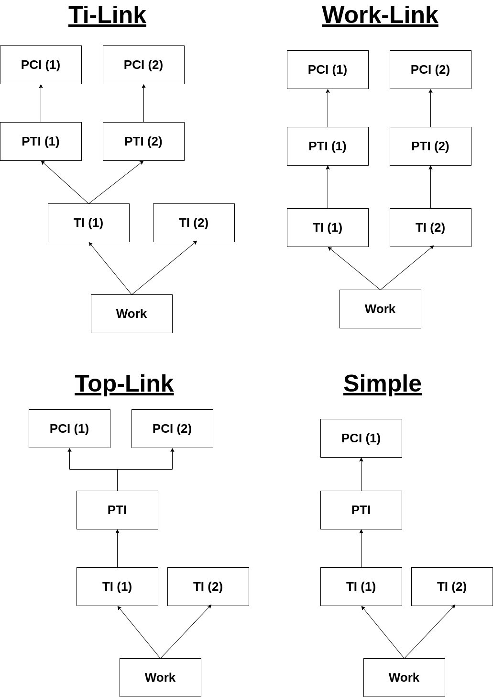
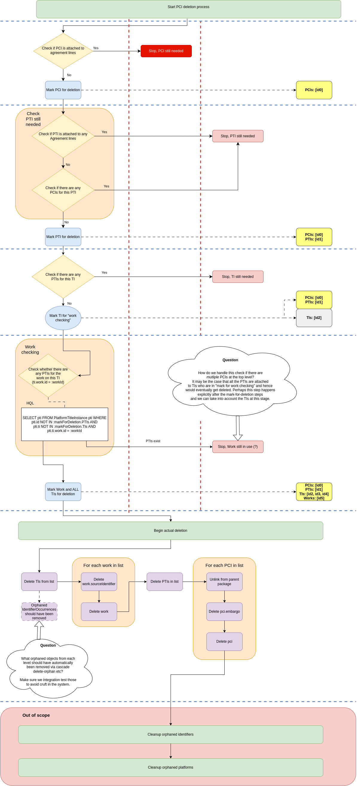

# Resource Deletion Documentation

## Problem Space

Users need a way to delete resources that have been harvested but are not in use and are no longer required. 

A user should be able to select one or more PCIs for deletion. The API should also allow for PTIs or TIs to be deleted. The API should only allow one resource type for deletion in each request.

A user should only be able to delete PCIs or packages that are not linked to agreement lines. 

If a user selects a PCI for deletion, any resources that are referenced by it cannot be deleted if they are referenced by other PCIs that haven't been marked for deletion. 

Resources can reference one another in various shapes. The most common would be a Work referencing two TIs, and one of those TIs referencing a PTI, which references one PCI. 

A diagram below shows all four structures that might exist between resources and therefore need to be tested.




## ErmResourceService::markForDelete() and ErmResourceService::deleteResources()


### Mark For Delete ([Code](https://github.com/folio-org/mod-agreements/blob/da1f030fd174d3efab1aa38aca5b7553331f58c0/service/grails-app/services/org/olf/ErmResourceService.groovy#L134))


There are four stages in the mark for deletion process:

1) Collect PCIs. Check if any still needed.


2) Collect PTIs. Check if any still needed.


3) Collect TIs. Check if any still needed.


4) Collect Works. Check if the works are still needed, if not, use the work to assign all TIs for deletion. 

Each step effectively involves checking resources at the current level which are valid for deletion, then using these to identify resources at the next level which need checking for deletion.




The delete resources method [Code](https://github.com/folio-org/mod-agreements/blob/da1f030fd174d3efab1aa38aca5b7553331f58c0/service/grails-app/services/org/olf/ErmResourceService.groovy#L295):

Deletes each resource type and saves which IDs are deleted in the response. Any directly linked entities such as Identifier Occurrences for TIs, or Embargos for PCIs, get deleted via Grail's orphan removal cascade.

## The API implementation

Endpoints look like: 

POST {{baseUrl}}/erm/resource/markForDelete/[resource_type]

POST {{baseUrl}}/erm/resource/delete/[resource_type]

where *resource_type* can be one of "pci", "pti", "ti".

Both endpoints accept a request body like: 

```{"resources": ["resource_id"]}```

The request body requires a minimum size of one resource id, or it will throw a validation error. The request body should only include resource ids of the resource_type parameter used. Any ids that cannot be found for a chosen resource_type will be skipped.

We implemented separate [/delete](https://github.com/folio-org/mod-agreements/blob/da1f030fd174d3efab1aa38aca5b7553331f58c0/service/grails-app/controllers/org/olf/ResourceController.groovy#L489) and [/markForDelete](https://github.com/folio-org/mod-agreements/blob/da1f030fd174d3efab1aa38aca5b7553331f58c0/service/grails-app/controllers/org/olf/ResourceController.groovy#L463) endpoints. This allows potential in the future for users to query which resources will be deleted, prior to carrying out the delete.

The /delete endpoint returns a response shape like:

```
{
  "deletedIds": {
    "pci": [
      "3ccc4f35-3cae-4cf5-af5e-f20b044ae7c3"
    ],
    "pti": [
      "5f2aa89e-fa56-4595-993c-7008ccf11f06"
    ],
    "ti": [
      "02ca4d9f-c3c2-4a46-859f-c706611ca4e5",
      "e781e8ed-6b76-4123-b159-3e115ee9c7f6"
    ],
    "work": [
      "090ea8b5-2aed-4ba8-b7c8-420e0b3e569a"
    ]
  },
  "statistics": {
    "pciDeleted": 1,
    "ptiDeleted": 1,
    "tiDeleted": 2,
    "workDeleted": 1
  }
}
```

And /markForDelete returns a response shape like:
```
{
  "pci": [],
  "pti": [],
  "ti": [],
  "work": []
}
```

## Permissions

Group-level perms:

```
{
  "permissionName": "erm.resources.delete",
  "displayName": "ERM delete resources",
  "description": "Mark resources for deletion and delete them",
  "subPermissions": [
    "erm.resources.delete.collection.execute",
    "erm.resources.markForDelete.collection.execute"
  ]
}
```

Endpoint-level perms:

```
{
  "methods": [
    "POST"
  ],
  "pathPattern": "/erm/resource/delete/*",
  "permissionsRequired": [
    "erm.resources.delete.collection.execute"
  ]
},
{
  "methods": [
    "POST"
  ],
  "pathPattern": "/erm/resource/markForDelete/*",
  "permissionsRequired": [
    "erm.resources.markForDelete.collection.execute"
  ]
}

```

Perm descriptions:

```
 {
    "permissionName": "erm.resources.markForDelete.collection.execute",
    "displayName": "ERM: Mark for delete resource collection",
    "description": "Allows POST to mark resources for deletion.",
    "visible": false
  },
  {
    "permissionName": "erm.resources.delete.collection.execute",
    "displayName": "ERM: Delete resource collection",
    "description": "Allows DELETE of resources from the DB",
    "visible": false
  }
```

## Testing

Each test case depends on the resource relationship structure, which resources are selected for deletion, and which resources are attached to agreement lines.

Any resource(s) of the same type can be marked for deletion, and no resources, PTIs, PCIs or a mixture could be attached to agreement lines. 

For example:

In the simple structure, the resources available are: PCI, PTI, 2x TI, Work. This means that a PCI, PTI, TI, or both TIs could be selected for deletion. The PCI, PTI, both, or neither, could also be attached to agreement lines.

We chose to test these using a combinatorial approach by leveraging the Spock "where" block.

[Code](https://github.com/folio-org/mod-agreements/blob/da1f030fd174d3efab1aa38aca5b7553331f58c0/service/src/integration-test/groovy/org/olf/DeleteResources/ResourceDeletionSpec.groovy#L187)
```java
where:
    testCase << allVerificationTestCases.collect { it }

```

In order to generate the test cases, the setupSpec() method needs to define which combinations of input resources and agreement lines can exist for each structure. These can then be iterated over, and their values used as [keys](https://github.com/folio-org/mod-agreements/blob/da1f030fd174d3efab1aa38aca5b7553331f58c0/service/src/integration-test/groovy/org/olf/DeleteResources/ResourceDeletionSpec.groovy#L78) to fetch expected responses from a JSON file.

[Code](https://github.com/folio-org/mod-agreements/blob/da1f030fd174d3efab1aa38aca5b7553331f58c0/service/src/integration-test/groovy/org/olf/DeleteResources/ResourceDeletionSpec.groovy#L93)
```java
allVerificationTestCases.add([
                structure: structure,
                resourceTypeToMark: resourceTypeToMark, // pci, pti, ti
                currentInputResources: inputResourceCombo,
                currentAgreementLines: agreementLineCombo,
                doDelete: doDeleteFlag,
                expectedMarkForDelete: expectedValue,
                initialKbStats: new HashMap<>(loadedKbStats[structure])
              ])
```

This approach means that, assuming the structure, resources and agreement lines stay the same, if we want to change the actual test method we only need to change it in one place, as opposed to in many separate tests. 

Each test does the same things:

- Clears the resources from the previous test
- Loads in the resources for the current test (e.g. the simple structure resources)
- Gets the IDs of the input resources and agreement lines for the current test.
- Creates the agreement line, then hits either the /markForDelete or /delete endpoint.
- Asserts that the ids deleted or marked for deletion match the expected ids, and if the number of resources existing in the database before and after the methods are called matches the expected number.

It also means that if e.g. new resources are added to the code that generates test cases for a structure, test cases missing expected values are flagged via an exception, making it more difficult to accidentally omit a test. 

A specific "language" is used in the tests to describe which resources should be marked for deletion after creation by the database. If two packages are used to generate resources for a structure, one package is assigned "package 1" and another "package 2". Resources belonging to each package are then assigned as PCI1 or PCI2, PTI1 or PTI2 etc... In the case when there is e.g. only one PCI/PTI, the lower number (usually PTI1) is used.  Several methods in the DeletionBaseSpec parse this language (e.g. PCI1) into the correct ID, which allows us to write tests like: Expect PCI1 is deleted --> PCI1 was deleted. This is necessary because different groups of resources need to be distinguishable as they lead to different deletion outcomes depending on which are selected for deletion or attached to agreement lines.

Extending the scenarios list itself is slightly more complicated and would depend on the desired change:

Example: Adding a new "structure"

If we decided another structure needed testing, several updates would need to be made:

- The JSON file containing expected values would need to be updated to include the new structure.
- resourcesForAgreementLinesStructure must include any resources that can be attached to agreement lines.
- inputResourceCombinationsByStructure must contain all possible combinations of input resources (those selected for deletion) in a structure.
- agreementLineCombinationsByStructure must then contain all possible combinations of resources that could be attached to agreement lines.
- New test packages would need to be defined that generate the resource structure desired.
- DeletionBaseSpec::seedDatabaseWithStructure() must include the new structure and import the new test packages.
- DeletionBaseSpec::findPackageName() must define the new package name.
- DeletionBaseSpec::parseResource() might need to be updated to define how to find any new resources in the database. 


## Notes


## Future

- Select a package for deletion